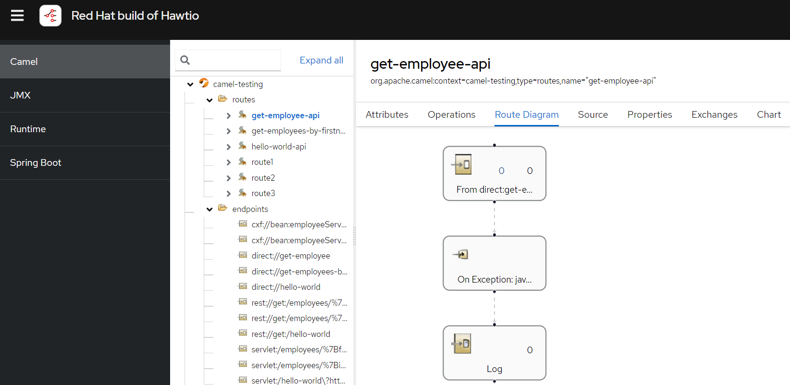

# Spring Boot and Camel 4

## Documentation
```
https://access.redhat.com/documentation/id-id/red_hat_build_of_apache_camel/4.4
```

## Camel Version
We are using `Apache Camel` version `4.4.0`
```xml
    <dependencyManagement>
        <dependencies>
            <dependency>
                <groupId>com.redhat.camel.springboot.platform</groupId>
                <artifactId>camel-spring-boot-bom</artifactId>
                <version>4.4.0.redhat-00014</version>
                <type>pom</type>
                <scope>import</scope>
            </dependency>
        </dependencies>
    </dependencyManagement>
```

## Concept
A Camel middleware in front of a legacy system (SOAP UI). Serving a REST API, firing a SOAP request to application behind it, and convert to JSON. 

```
+-------------+           +--------------+            +--------------+
| Rest API    | --GET---> |    Camel     | --SOAP-->  |    SOAP UI   |
|             | <--JSON-- |              | <--SOAP--  |              |
+-------------+           +--------------+            +--------------+
```

## Request
```
$  curl -kv http://localhost:8080/api/employees/1
*   Trying [::1]:8080...
* Connected to localhost (::1) port 8080
> GET /api/employees/1 HTTP/1.1
> Host: localhost:8080
> User-Agent: curl/8.4.0
> Accept: */*
>
< HTTP/1.1 200
< Content-Type: application/json
< Transfer-Encoding: chunked
< Date: Mon, 17 Jun 2024 02:54:19 GMT
<
* Connection #0 to host localhost left intact
{"employee":{"address":[{"fromdate":1032800400000,"todate":1348419600000,"address":"Jakarta"}],"id":1,"firstname":"whatever","lastname":"something","birthdate":243882000000,"gender":"M"}}  

$ curl -kv http://localhost:8080/api/employees/edwin/kun
*   Trying [::1]:8080...
* Connected to localhost (::1) port 8080
> GET /api/employees/edwin/kun HTTP/1.1
> Host: localhost:8080
> User-Agent: curl/8.4.0
> Accept: */*
>
< HTTP/1.1 200
< Content-Type: application/json
< Transfer-Encoding: chunked
< Date: Mon, 17 Jun 2024 02:55:07 GMT
<
* Connection #0 to host localhost left intact
{"employee":[{"address":[{"fromdate":1032800400000,"todate":1348419600000,"address":"Jakarta"}],"id":1,"firstname":"whatever","lastname":"something","birthdate":243882000000,"gender":"M"},{"address":[{"fromdate":1035392400000,"todate":1351011600000,"address":"Bandung"}],"id":2,"firstname":"wiro","lastname":"sableng","birthdate":246474000000,"gender":"F"}]} 
```

## Default Error Message
If we turn SoapUI off, Camel will give below response as default error message
```
$ curl -kv http://localhost:8080/api/employees/edwin/kun
*   Trying [::1]:8080...
* Connected to localhost (::1) port 8080
> GET /api/employees/edwin/kun HTTP/1.1
> Host: localhost:8080
> User-Agent: curl/8.4.0
> Accept: */*
>
< HTTP/1.1 500
< Content-Type: application/json
< Transfer-Encoding: chunked
< Date: Mon, 17 Jun 2024 03:23:56 GMT
< Connection: close
<
* Closing connection
{"reason":"Response was of unexpected text/html ContentType.  Incoming portion of HTML stream: <html><body><p>There are currently 0 running SoapUI MockServices</p><ul></ul></p></body></html>","error":"exception happen"}
```

## WSDL
```xml
<?xml version="1.0" encoding="UTF-8" standalone="no"?>
<wsdl:definitions xmlns:soap="http://schemas.xmlsoap.org/wsdl/soap/"
				  xmlns:tns="http://localhost/employee"
				  xmlns:wsdl="http://schemas.xmlsoap.org/wsdl/"
				  xmlns:xsd="http://www.w3.org/2001/XMLSchema"
				  name="EmployeeService" targetNamespace="http://localhost/employee">
	<wsdl:documentation>SOAP Definition for ws-employee</wsdl:documentation>
	<wsdl:types>
		<xsd:schema>
			<xsd:import namespace="http://localhost/employee" schemaLocation="employee.xsd"/>
		</xsd:schema>
	</wsdl:types>
	<wsdl:message name="EmployeeByIdRequest">
		<wsdl:part name="parameters" element="tns:EmployeeByIdRequest"/>
	</wsdl:message>
	<wsdl:message name="EmployeeByNameRequest">
		<wsdl:part name="parameters" element="tns:EmployeeByNameRequest"/>
	</wsdl:message>
	<wsdl:message name="EmployeeResponse">
		<wsdl:part name="parameters" element="tns:EmployeeResponse"/>
	</wsdl:message>
	<wsdl:message name="EmployeesResponse">
		<wsdl:part name="parameters" element="tns:EmployeesResponse"/>
	</wsdl:message>

	<!--This element defines the service operations and the combination of input and output elements to clients-->
	<wsdl:portType name="EmployeeServicePortType">
		<wsdl:operation name="GetEmployeeById">
			<wsdl:input message="tns:EmployeeByIdRequest"/>
			<wsdl:output message="tns:EmployeeResponse"/>
		</wsdl:operation>
		<wsdl:operation name="GetEmployeesByName">
			<wsdl:input message="tns:EmployeeByNameRequest"/>
			<wsdl:output message="tns:EmployeesResponse"/>
		</wsdl:operation>
	</wsdl:portType>

	<!-- This element provides specific details on how an operation will actually be transmitted over the network-->
	<wsdl:binding name="EmployeeServiceSOAP" type="tns:EmployeeServicePortType">
		<soap:binding style="document" transport="http://schemas.xmlsoap.org/soap/http"/>
		<wsdl:operation name="GetEmployeeById">
			<soap:operation soapAction="http://localhost/employee/GetEmployeeById"/>
			<wsdl:input>
				<soap:body use="literal"/>
			</wsdl:input>
			<wsdl:output>
				<soap:body use="literal"/>
			</wsdl:output>
		</wsdl:operation>
		<wsdl:operation name="GetEmployeesByName">
			<soap:operation soapAction="http://localhost/employee/GetEmployeesByName"/>
			<wsdl:input>
				<soap:body use="literal"/>
			</wsdl:input>
			<wsdl:output>
				<soap:body use="literal"/>
			</wsdl:output>
		</wsdl:operation>
	</wsdl:binding>

	<!-- Definition of the service and the endpoint. -->
	<wsdl:service name="EmployeeService">
		<wsdl:port name="EmployeeServiceSOAP" binding="tns:EmployeeServiceSOAP">
			<soap:address location="the-url-service-goes-here"/>
		</wsdl:port>
	</wsdl:service>
</wsdl:definitions>
```

```xml
<?xml version="1.0" encoding="UTF-8"?>
<xs:schema xmlns:xs="http://www.w3.org/2001/XMLSchema" xmlns:vc="http://www.w3.org/2007/XMLSchema-versioning" xmlns:n1="http://localhost/employee" targetNamespace="http://localhost/employee" elementFormDefault="qualified" attributeFormDefault="unqualified" vc:minVersion="1.1">
	<xs:element name="employee">
		<xs:annotation>
			<xs:documentation>Employee personal information</xs:documentation>
		</xs:annotation>
		<xs:complexType>
			<xs:sequence maxOccurs="unbounded">
				<xs:element ref="n1:address"/>
			</xs:sequence>
			<xs:attribute name="id" type="xs:long" use="required"/>
			<xs:attribute name="firstname" type="xs:string" use="required"/>
			<xs:attribute name="lastname" type="xs:string" use="required"/>
			<xs:attribute name="birthdate" type="xs:date" use="required"/>
			<xs:attribute name="gender" type="xs:string" use="required"/>
		</xs:complexType>
	</xs:element>
	<xs:element name="address">
		<xs:annotation>
			<xs:documentation>Address of the employee</xs:documentation>
		</xs:annotation>
		<xs:complexType>
			<xs:attribute name="fromdate" type="xs:date" use="required"/>
			<xs:attribute name="todate" type="xs:date" use="optional"/>
			<xs:attribute name="address" type="xs:string" use="required"/>
		</xs:complexType>
	</xs:element>
	<xs:element name="EmployeeResponse">
		<xs:complexType>
			<xs:sequence minOccurs="0">
				<xs:element ref="n1:employee"/>
			</xs:sequence>
		</xs:complexType>
	</xs:element>
	<xs:element name="EmployeesResponse">
		<xs:complexType>
			<xs:sequence minOccurs="0" maxOccurs="unbounded">
				<xs:element ref="n1:employee"/>
			</xs:sequence>
		</xs:complexType>
	</xs:element>
	<xs:element name="EmployeeByIdRequest">
		<xs:annotation>
			<xs:documentation>Query employee by Id</xs:documentation>
		</xs:annotation>
		<xs:complexType>
			<xs:attribute name="id" type="xs:long" use="required"/>
		</xs:complexType>
	</xs:element>
	<xs:element name="EmployeeByNameRequest">
		<xs:annotation>
			<xs:documentation>Query an employee by name</xs:documentation>
		</xs:annotation>
		<xs:complexType>
			<xs:attribute name="firstname" type="xs:string" use="optional"/>
			<xs:attribute name="lastname" type="xs:string" use="optional"/>
		</xs:complexType>
	</xs:element>
</xs:schema>
```

## Hawtio Monitoring
Opening `http://localhost:8080/actuator/hawtio` will open Hawtio console where we can see the statistics of our Camel routes

